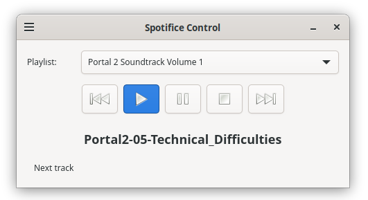

# Spotifice Media Control GUI

Graphical media control for Spotifice, implemented with GTK4 and ZeroC Ice.



## Description

This repository provides a graphical user interface (GUI) to access Spotifice services. The application allows you to manage playlists, play music, and control playback in a visual and intuitive way.

## Features

- 🎵 **Playlist Management**: Dropdown selector to switch between different playlists.
- ▶️ **Playback Controls**: Buttons for Play, Pause, Stop, Previous, and Next.
- 🎼 **Track Display**: Shows the current song title with scrolling animation for long titles.
- 🔌 **MPRIS2 Integration**: Support for system media control on Linux (optional).
- 🎨 **GTK4 Interface**: Modern and responsive UI built with GTK 4.

## Architecture

The program uses **ZeroC Ice** as distributed communication middleware, implementing a client-server architecture:

## Configuration

**File**: `control.config`

Ice configuration file that specifies:
```
MediaServer.Proxy=mediaServer1:tcp -p 10000
MediaRender.Proxy=mediaRender1:tcp -p 10001
```

## Requirements

- Python 3.8+
- PyGObject (GTK 4)
- ZeroC Ice for Python
- MPRIS2 Support (optional)

## Installation

Install system dependencies (Ubuntu/Debian)

```bash
sudo apt install python3-zeroc-ice python3-gi python3-gi-cairo gir1.2-gtk-4.0
```

## Usage

```bash
python3 media_control_v1.py control.config
```

Make sure the `MediaServer` and `MediaRender` servers are running on the ports specified in `control.config`.

## Main Class Structure

- `SpotificeControlWindow`: Main application window
- `SpotificeApp`: GTK application class
- `UIBuilder`: Interface component builder
- `MPRIS2Service`: D-Bus integration service

## License

This project is part of an academic exercise for the Distributed Systems course.

## Authors

Distributed Systems course teachers at UCLM.
